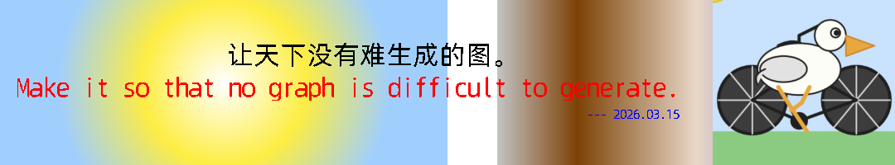

# canvas-cli
pure rust implemented drawer library( api like canvas), and no dependencies, super lightweight, can be used in any rust project, including wasm and embedded.



## For AI

使用本工具，可以让“非生图” AI 模型可以“生成图片”

Enables AI models that do not produce raw images to generate images 

### Example
```prompt
Use the `canvas-cli` skill to draw a system architecture diagram for an e-commerce platform. It features engineering precision and clear geometry.

Main colors: blue (#2563EB), cyan, gray, white lines
Background colors: dark blue (#1E3A5F), white or light gray, with a grid
Embellishing: amber highlights (#F59E0B), cyan annotations

Engineering drawing: blue background with white text, dimensions, grid
```


## Anti-aliasing

支持抗锯齿，可以渲染出来更平滑的线条和文字

It supports anti-aliasing, which can render smoother lines and text.


## Use Cli
```sh
# Draw from input.txt and save to output.png
canvas-cli --input=input.txt --output=output.png

# Draw from input string and save to output.png
canvas-cli --input="canvas 1080 200; [operation] [args...]" --output=output.png

# Draw from input string and output base64 PNG data URL to stdout
canvas-cli --input="canvas 1080 200; [operation] [args...]" --output-data-url
```

#### input.txt format
1. canvas [width] [height]
2. [operation] [args...]

input.txt example:
```txt
canvas 1080 200
# 左边一半背景 - 径向渐变 (从中心向外)
create_radial_gradient radial_bg 270 100 0 270 100 200
add_color_stop radial_bg 0 white
add_color_stop radial_bg 0.5 #fded43
add_color_stop radial_bg 1 #a1cffd
set_fill_gradient radial_bg
fill_rect 0 0 540 200

# 右边一半背景 - 线性渐变 (从左到右)
create_linear_gradient linear_bg 600 0 1080 0
add_color_stop linear_bg 0 #c3c3c3
add_color_stop linear_bg 0.2 #7c4105
add_color_stop linear_bg 0.5 #e8d8c8
add_color_stop linear_bg 1 #2b05b6
set_fill_gradient linear_bg
fill_rect 550 0 240 200

# 画一张图片，设置位置
draw_image ../images/tests/image_220x200.png 860 0

# 画一张图片，设置位置，并调整宽高
draw_image ../images/tests/image_220x200.png 800 0 50 95

# 画一张图片，选取部分图片，设置位置，并调整宽高
draw_image ../images/tests/image_220x200.png 50 50 100 100 800 105 50 95

# 设置文字颜色和字体
set_fill_style black
set_font 32px common

# 设置抗锯齿，默认就是 4，设置为 1 则没有抗锯齿
set_text_antialias_grid 4

# 居中对齐
set_text_align center
fill_text "让天下没有难生成的图。" 450 50
set_fill_style #ff0000
set_text_align start
set_font 32px common
fill_text "Make it so that no graph is difficult to generate." 20 90
set_fill_style blue
set_font 16px common
set_text_align right
fill_text "--- 2026.03.15" 820 130
```


## Use in Rust Code

```rust
use canvas_rs::Canvas;
use canvas_rs::images;

func main() {
    let canvas = Canvas::new(200, 200);
    let canvas = Canvas::new(1080, 200);
    let mut ctx = canvas.get_context("2d").unwrap();

    let png_bytes = std::fs::read("tests/image_220x200.png").expect("could not read PNG file");
    let img_data = images::from_png(&png_bytes).expect("could not decode PNG");
    ctx.draw_image(&img_data, 860.0, 0.0);

    // Draw text inside the rects (30px from edge)
    ctx.set_fill_style("black");
    ctx.set_font("32px common");

    // Line 1: Chinese
    ctx.fill_text("让天下没有难生成的图。", 20.0, 50.0);

    // Line 2: English
    ctx.set_fill_style("red");
    ctx.fill_text("Make it so that no graph is difficult to generate.", 20.0, 90.0);

    // Line 3: Date
    ctx.set_fill_style("blue");
    ctx.set_font("16px common");
    ctx.fill_text("--- 2026.03.15", 20.0, 130.0);

    // Generate base64 PNG data URL
    let url = images::to_data_url(&canvas);
}


```

## Development

```
cargo run --bin canvas-cli -- --draw --input=./test/input.txt --output=output.png
```

## round_rect

`round_rect` 用于把圆角矩形追加到当前路径，然后配合 `fill` 或 `stroke` 进行填充/描边。

语法：

```txt
begin_path
round_rect <x> <y> <w> <h> <radii>
fill
stroke
```

`<radii>` 支持 1 到 4 个半径值，顺序和 CSS 一样：

- 1 个值：四个角相同
- 2 个值：左上/右下，右上/左下
- 3 个值：左上，右上/左下，右下
- 4 个值：左上，右上，右下，左下

示例：

```txt
canvas 400 200
set_fill_style #2563EB
begin_path
round_rect 50 40 300 120 24,24,24,24
fill
```

## License
MIT License